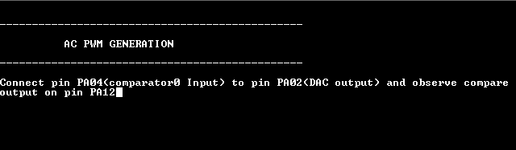

# AC PWM generation

This example application shows how to use the Analog Comparator Peripheral library to generate a 1KHz PWM waveform.

## Description

The AC peripheral is configured to generate analog PWM waveform by comparing the sine wave generated from the DAC with the reference voltage selected as a VDD scaler. The duty cycle of the analog PWM is changed by pressing a switch which changes the value of the VDD scaler.

## Downloading and building the application

To clone or download this application from Github, go to the [main page of this repository](https://github.com/Microchip-MPLAB-Harmony/csp_apps_sam_d21_da1) and then click **Clone** button to clone this repository or download as zip file.
This content can also be downloaded using content manager by following these [instructions](https://github.com/Microchip-MPLAB-Harmony/contentmanager/wiki).

Path of the application within the repository is **apps/ac/ac_wav_gen/firmware** .

To build the application, refer to the following table and open the project using its IDE.

| Project Name      | Description                                    |
| ----------------- | ---------------------------------------------- |
| sam_d21_xpro.X | MPLABX project for [SAM D21 Xplained Pro Evaluation Kit](https://www.microchip.com/developmenttools/ProductDetails/atsamd21-xpro) |
| sam_da1_xpro.X | MPLABX project for [SAM DA1 Xplained Pro Evaluation Kit](https://www.microchip.com/DevelopmentTools/ProductDetails/PartNO/ATSAMDA1-XPRO) |
|||

## Setting up the hardware

The following table shows the target hardware for the application projects.

| Project Name| Board|
|:---------|:---------:|
| sam_d21_xpro.X | [SAM D21 Xplained Pro Evaluation Kit](https://www.microchip.com/developmenttools/ProductDetails/atsamd21-xpro)
| sam_da1_xpro.X | [SAM DA1 Xplained Pro Evaluation Kit](https://www.microchip.com/DevelopmentTools/ProductDetails/PartNO/ATSAMDA1-XPRO)
|||

### Setting up [SAM D21 Xplained Pro Evaluation Kit](https://www.microchip.com/developmenttools/ProductDetails/atsamd21-xpro)

- Connect a jumper between pin PA04 (Pin 17 of the EXT1 ) and PA02 (Pin 3 of the EXT3 header)
- Use the Logic Analyzer/Oscilloscope and probe PA12 pin (Pin 7 of the EXT3 header) to observe the PWM output
- Connect the Debug USB port on the board to the computer using a micro USB cable

### Setting up [SAM DA1 Xplained Pro Evaluation Kit](https://www.microchip.com/DevelopmentTools/ProductDetails/PartNO/ATSAMDA1-XPRO)

- Connect a jumper between pin PA04 (Pin 17 of the EXT1 ) and PA02 (Pin 3 of the EXT3 header)
- Use the Logic Analyzer/Oscilloscope and probe PA12 pin (Pin 7 of the EXT3 header) to observe the PWM output
- Connect the Debug USB port on the board to the computer using a micro USB cable

## Running the Application

1. Open the Terminal application (Ex.:Tera term) on the computer
2. Connect to the EDBG Virtual COM port and configure the serial settings as follows:
    - Baud : 115200
    - Data : 8 Bits
    - Parity : None
    - Stop : 1 Bit
    - Flow Control : None
3. Build and Program the application using its IDE
4. Observe output message in console as follows (*NOTE: Pin numbers will vary as per the device*):

    

5. Observe the PWM waveform using the oscilloscope connected to the PWM output pin

    

6. Press switch to change the duty cycle of PWM waveform

Refer to the following table for pwm output and switch details:

| Board| PWM output pin | Switch|
|------|----------------| ------ |
| [SAM D21 Xplained Pro Evaluation Kit](https://www.microchip.com/developmenttools/ProductDetails/atsamd21-xpro) |PA12 pin (Pin 7 of the EXT3 header) | SW0 |
| [SAM DA1 Xplained Pro Evaluation Kit](https://www.microchip.com/DevelopmentTools/ProductDetails/PartNO/ATSAMDA1-XPRO) |PA12 pin (Pin 7 of the EXT3 header) | SW0 |
|||
