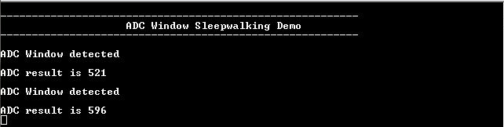

# ADC window sleepwalking

This application shows how to configure ADC in a sleepwalking operation, where input voltage is measured at a fixed interval, but device is not woken from sleep until the measured value is below a given threshold.

## Description

This example application shows how to use the ADC Peripheral library to perform sleepwalking.
The ADC peripheral is configured to operate in window mode. The ADC conversion is triggered by RTC compare 0 event. On every trigger, window detection operation is performed in standby sleep. The window interrupt is generated when the input voltage falls below the window upper threshold and the CPU is woken up by this interrupt. ADC window upper threshold is configured as 1/4 th of the reference voltage.

| Board | ADC window upper threshold |
| ----- | -------------------------- |
| [SAM D21 Xplained Pro Evaluation Kit](https://www.microchip.com/developmenttools/ProductDetails/atsamd21-xpro) | 0.4125 V |
| [SAM DA1 Xplained Pro Evaluation Kit](https://www.microchip.com/DevelopmentTools/ProductDetails/PartNO/ATSAMDA1-XPRO) | 0.4125 V |
|||

## Downloading and building the application

To clone or download this application from Github, go to the [main page of this repository](https://github.com/Microchip-MPLAB-Harmony/csp_apps_sam_d21_da1) and then click **Clone** button to clone this repository or download as zip file.
This content can also be downloaded using content manager by following these [instructions](https://github.com/Microchip-MPLAB-Harmony/contentmanager/wiki).

Path of the application within the repository is **apps/adc/adc_window_sleepwalking/firmware** .

To build the application, refer to the following table and open the project using its IDE.

| Project Name      | Description                                    |
| ----------------- | ---------------------------------------------- |
| sam_d21_xpro.X | MPLABX project for [SAM D21 Xplained Pro Evaluation Kit](https://www.microchip.com/developmenttools/ProductDetails/atsamd21-xpro) |
| sam_da1_xpro.X | MPLABX project for [SAM DA1 Xplained Pro Evaluation Kit](https://www.microchip.com/DevelopmentTools/ProductDetails/PartNO/ATSAMDA1-XPRO) |
|||

## Setting up the hardware

The following table shows the target hardware for the application projects.

| Project Name| Board|
|:---------|:---------:|
| sam_d21_xpro.X | [SAM D21 Xplained Pro Evaluation Kit](https://www.microchip.com/developmenttools/ProductDetails/atsamd21-xpro)
| sam_da1_xpro.X | [SAM DA1 Xplained Pro Evaluation Kit](https://www.microchip.com/DevelopmentTools/ProductDetails/PartNO/ATSAMDA1-XPRO)
|||

### Setting up [SAM D21 Xplained Pro Evaluation Kit](https://www.microchip.com/developmenttools/ProductDetails/atsamd21-xpro)

- Connect a voltage below the selected ADC reference voltage (VDDANA/2) to pin 14 (PB08 – ADC_AIN2) of the EXT1 connector
- Connect the Debug USB port on the board to the computer using a micro USB cable

### Setting up [SAM DA1 Xplained Pro Evaluation Kit](https://www.microchip.com/DevelopmentTools/ProductDetails/PartNO/ATSAMDA1-XPRO)

- Connect a voltage below the selected ADC reference voltage (VDDANA/2) to pin 14 (PB08 – ADC_AIN2) of the EXT1 connector
- Connect the Debug USB port on the board to the computer using a micro USB cable

## Running the Application

1. Open the Terminal application (Ex.:Tera term) on the computer
2. Connect to the EDBG Virtual COM port and configure the serial settings as follows:
    - Baud : 115200
    - Data : 8 Bits
    - Parity : None
    - Stop : 1 Bit
    - Flow Control : None
3. Build and Program the application using its IDE
4. Console displays ADC Window Detected when ADC input is lower than 1/4 th of the reference
voltage (i.e below 0.4125 V):

    
