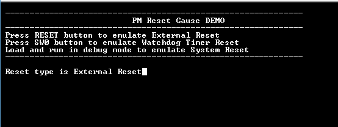

# PM reset cause

This example shows how to use the PM peripheral to indicate the cause of the device reset.

## Description

The Power Manager (PM) peripheral collects the various reset sources and generates reset for the device and allows the reset
source to be identified by the software:

- **Power On Reset**: The device contains a power-on-reset (POR) detector, which keeps the system reset until power is stable( This eliminates the need for external reset circuitry to guarantee stable operation when powering up the device)
- **VDDCORE Brown Out Reset**: BOD12 will reset the device if a voltage of 1.2 V or below is observed on the I/O pin supplying power to the MCU core (VDDCORE)
- **VDDANA Brown Out Reset**: BOD33 resets the device if the voltage on the VDDANA pin falls below a value configured by the SYSCTRL
- **Watchdog Reset**: The watchdog reset occurs when it times out
- **System Reset**: The System Reset Request is a software reset generated by the CPU when asserting the SYSRESETREQ bit located in the Reset Control register of the CPU
- **External Reset**: A external reset is generated when a low level is detected on the RESET pin

This example application uses the PM peripheral to indicate the user Reset and the Watchdog reset. The WDT reset is emulated
by not feeding the watchdog on switch press.

## Downloading and building the application

To clone or download this application from Github, go to the [main page of this repository](https://github.com/Microchip-MPLAB-Harmony/csp_apps_sam_d21_da1) and then click **Clone** button to clone this repository or download as zip file.
This content can also be downloaded using content manager by following these [instructions](https://github.com/Microchip-MPLAB-Harmony/contentmanager/wiki).

Path of the application within the repository is **apps/pm/pm_reset_cause/firmware** .

To build the application, refer to the following table and open the project using its IDE.

| Project Name      | Description                                    |
| ----------------- | ---------------------------------------------- |
| sam_d21_xpro.X | MPLABX project for [SAM D21 Xplained Pro Evaluation Kit](https://www.microchip.com/developmenttools/ProductDetails/atsamd21-xpro) |
| sam_da1_xpro.X | MPLABX project for [SAM DA1 Xplained Pro Evaluation Kit](https://www.microchip.com/DevelopmentTools/ProductDetails/PartNO/ATSAMDA1-XPRO) |
|||

## Setting up the hardware

The following table shows the target hardware for the application projects.

| Project Name| Board|
|:---------|:---------:|
| sam_d21_xpro.X | [SAM D21 Xplained Pro Evaluation Kit](https://www.microchip.com/developmenttools/ProductDetails/atsamd21-xpro)
| sam_da1_xpro.X | [SAM DA1 Xplained Pro Evaluation Kit](https://www.microchip.com/DevelopmentTools/ProductDetails/PartNO/ATSAMDA1-XPRO)
|||

### Setting up [SAM D21 Xplained Pro Evaluation Kit](https://www.microchip.com/developmenttools/ProductDetails/atsamd21-xpro)

- Connect the Debug USB port on the board to the computer using a micro USB cable

### Setting up [SAM DA1 Xplained Pro Evaluation Kit](https://www.microchip.com/DevelopmentTools/ProductDetails/PartNO/ATSAMDA1-XPRO)

- Connect the Debug USB port on the board to the computer using a micro USB cable

## Running the Application

1. Open the Terminal application (Ex.:Tera term) on the computer
2. Connect to the EDBG Virtual COM port and configure the serial settings as follows:
    - Baud : 115200
    - Data : 8 Bits
    - Parity : None
    - Stop : 1 Bit
    - Flow Control : None
3. Build and Program the application using its IDE
4. LED is blinked continuously using the SysTick Timer
5. Console displays the following message:

    

6. Watchdog timer is fed periodically using System Timer (SysTick) to prevent the WDT reset and the LED is toggled

    - The following table provides switch and led name:

    | Board      | Switch Name | LED Name   |
    | ---------- | ----------- | ---------- |
    | [SAM D21 Xplained Pro Evaluation Kit](https://www.microchip.com/developmenttools/ProductDetails/atsamd21-xpro)  |SW0 | LED0 |
    | [SAM DA1 Xplained Pro Evaluation Kit](https://www.microchip.com/DevelopmentTools/ProductDetails/PartNO/ATSAMDA1-XPRO)  |SW0 | LED0 |
    ||||

7. Press the switch to put the system in deadlock. The LED should stop blinking. The WDT will reset the device in four seconds and the demonstration should restart